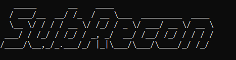

# SubRecon
# Subdomain Enumeration Tool
<h1 align="center">
  
   
</h1>

# Fast Subdomain Enumeration Tool

In SubRecon, you can search valid subdomains of websites using various tools. This tool makes it easy to find subdomains from multiple tools at once. Each tool is checked one by one, all the data is collected and stored in a file, then all the unique subdomains are sorted, and the status code is obtained by sending it to httpx-toolkit for checking and saving the output. Also, with the help of DNSRECONS, you can see all types of DNS records for the subdomains, and they will be stored in a separate file (dnsrecon_result.txt).

# Features 

- Designed to be fast and resource-light
- Easy to use

# Usage

- python subrecon.py

-Then enter the target domain

# Installation 

    git clone 

# Prerequisite
- To use this tool you have to install few other tools like subfinder, assetfinder, findomain, dnsrecon and httpx-toolkit.

# Subfinder
- Subfinder tool requires go1.20 to install successfully. Run the following command to install the latest version:
  
      go install -v github.com/projectdiscovery/subfinder/v2/cmd/subfinder@latest
  
# assetfinder
- Assetfinder tool requires go language to install successfully. Run the following command to install the latest version:

      go get -u github.com/tomnomnom/assetfinder

# findomain
- Run the following command to install the latest version:
  
      git clone https://github.com/findomain/findomain.git
      cd findomain
      cargo build --release
      sudo cp target/release/findomain /usr/bin/
      findomain

# dnsrecon
-Run the following command to install the latest version:
           
             git clone https://github.com/darkoperator/dnsrecon.git
             cd dnsrecon
             pip install -r requirements.txt
             python setup.py install

# httpx-toolkit
- Run the following command to install the latest version:

      sudo apt install httpx-toolkit

